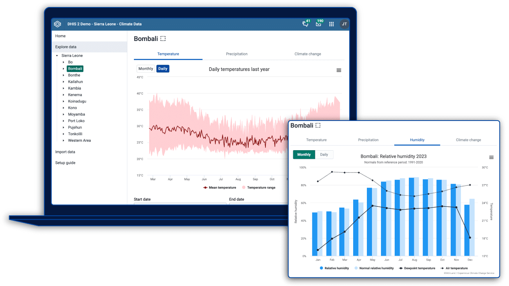

---
hide:
  - navigation
---

# Climate Data

The Chap Modeling Platform supports several prediction models that use climate indicators such as precipitation and temperature. The Climate App and Climate Data Tools enable a variety of climate and environmental data sources to be integrated effectively into DHIS2, where data is harmonized into the same organization hierarchy as disease data is stored.

<a class="climate-item" href="https://dhis2.org/climate/climate-data/" target="_blank" rel="noopener">

Climate App

A DHIS2 application for integrating climate, weather, and environmental data directly into your health information system. Import and visualize climate data alongside health indicators to support climate-informed decision-making.

</a>

<a class="climate-item" href="https://climate-tools.dhis2.org/" target="_blank" rel="noopener">

Climate Data Tools

An open-source Python toolkit to access, process, and upload climate and environmental data into DHIS2 and the CHAP Modeling Platform. Designed for data engineers and scientists working on climate-health analysis and automated data workflows.

</a>

