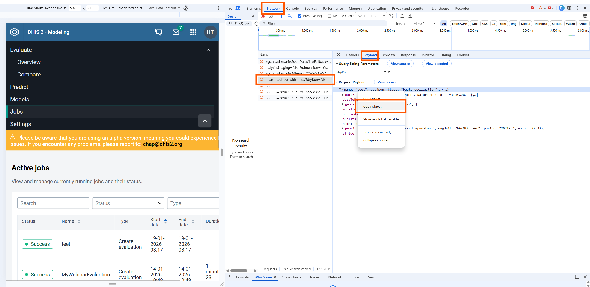

# Extracting Climate & Environmental Data for Modelling in DHIS2

This short guide describes how to import climate and environmental data, configure a model in the DHIS2 Modelling App, and extract the modelling payload.

## 1. Import data using the Climate App

Use the Climate App to import climate and environmental indicators at the **same organisational level and period type** (weekly or monthly) as your disease data. Indicators of interest, include air temperature, CHRIPS precipitation (or ERA5-Land precipitation if you know this perform better), relative humidity, NDVI (vegetation), and urban/built-up areas. You may also include other disease-relevant indicators such as soil moisture, surface water, land surface temperature, or elevation. Ensure all imported data are available as data elements.

## 2. Run analytics

After importing the data, run analytics in DHIS2.

## 3. Open the Modelling App

Open the Modelling App and confirm you are using the latest version.

## 4. Create a model

Go to Models, click New model, and select **CHAP-EWARS Model**. This model supports additional covariates. Give the model a clear name such as `extract_data`. Leave n_lags, precision, and regional seasonal settings unchanged.

## 5. Add covariates

Add all additional covariates you imported via the Climate App by typing their names and using underscores instead of spaces (for example `NDVI` or `relative_humidity`). Do not add precipitation or mean temperature, as these are already included by default. Save the model when finished.

## 6. Create an evaluation

Go to Evaluate and create a new evaluation. Select the period type, date range, organisation units, and the model you just created.

## 7. Configure datasets

Open Dataset Configuration and map each covariate to its corresponding climate data element. Also map the disease disease data and population data. Save the configuration.

## 8. Run a dry run

Click Start dry run to verify that the data and configuration are accepted. Continue only if the dry run succeeds.

## 9. Extract the payload

Right-click the page and choose Inspect. In the Network tab, click **Send data** in the Modelling App and locate a request named stating with `create-backtest-with-data`. Open the request, go to the Payload tab, copy the full payload, and paste it into the shared Google Drive file. The picture below show where you could find the payload.

## 10. Clean up (optional)

After extracting the payload, you may delete the evaluation and the model to keep the Modelling App clean.
